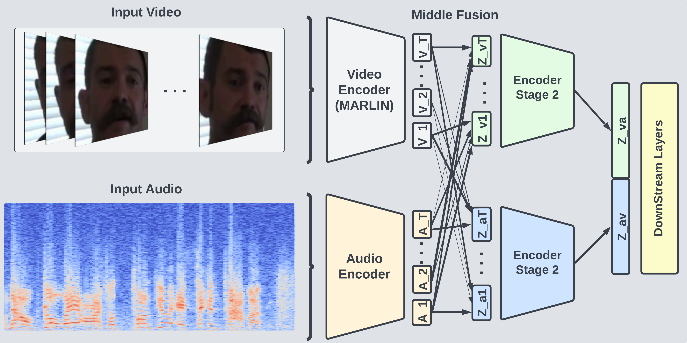

# 2D3MF: Deepfake Detection using Multi Modal Middle Fusion

<div align="center">
    <!--  -->
    
</div>

<!--<div>-->
<!--    -->
<!--    <p></p>-->
<!--</div>-->

<!--<div align="center">-->
<!--    <a href="https://github.com/ControlNet/MARLIN/network/members">-->
<!--        -->
<!--    </a>-->
<!--    <a href="https://github.com/ControlNet/MARLIN/stargazers">-->
<!--        -->
<!--    </a>-->
<!--    <a href="https://github.com/ControlNet/MARLIN/issues">-->
<!--        -->
<!--    </a>-->
<!--    <a href="https://github.com/ControlNet/MARLIN/blob/master/LICENSE">-->
<!--        -->
<!--    </a>-->
<!--    <a href="https://arxiv.org/abs/2211.06627">-->
<!--        -->
<!--    </a>-->
<!--</div>-->

<!--<div align="center">    -->
<!--    <a href="https://pypi.org/project/marlin-pytorch/">-->
<!--        -->
<!--    </a>-->
<!--    <a href="https://pypi.org/project/marlin-pytorch/">-->
<!--        -->
<!--    </a>-->
<!--    <a href="https://www.python.org/"></a>-->
<!--    <a href="https://pytorch.org/"></a>-->
<!--</div>-->

<!--<div align="center">-->
<!--    <a href="https://github.com/ControlNet/MARLIN/actions"></a>-->
<!--    <a href="https://github.com/ControlNet/MARLIN/actions"></a>-->
<!--    <a href="https://coveralls.io/github/ControlNet/MARLIN"></a>-->
<!--</div>-->

This repo is the implementation for the paper
[2D3MF: Deepfake Detection using Multi Modal Middle Fusion](https://).

## Repository Structure

```
.
├── assets                # Images for README.md
├── LICENSE
├── README.md
├── MODEL_ZOO.md
├── CITATION.cff
├── .gitignore
├── .github

# below is for the PyPI package marlin-pytorch
├── src                   # Source code for marlin-pytorch and audio feature extractors
├── tests                 # Unittest
├── requirements.lib.txt
├── setup.py
├── init.py
├── version.txt

# below is for the paper implementation
├── configs              # Configs for experiments settings
├── model                # 2D3MF & Marlin models
├── preprocess           # Preprocessing scripts
├── dataset              # Dataloaders
├── utils                # Utility functions
├── train.py             # Training script
├── evaluate.py          # Evaluation script
├── requirements.txt

```

## Installing and running our model

## Paper Implementation

## Feature Extraction - MARLIN

Requirements:

- Python >= 3.7, < 3.12
- PyTorch ~= 1.11
- Torchvision ~= 0.12
- ffmpeg

Install MARLIN (our feature extractor) from PyPI:

```bash
pip install marlin-pytorch
```

For more details, see [MODEL_ZOO.md](MODEL_ZOO.md).

## Installation

Install PyTorch from the [official website](https://pytorch.org/get-started/locally/)

Clone the repo and install the requirements:

```bash
git clone https://github.com/aiden200/2D3MF
cd 2D3MF
pip install -r requirements.txt
```

## Training

### 1. Download Datasets

<details>
  <summary>Forensics++</summary>
We cannot offer the direct script in our repository due to their terms on using the dataset. Please follow the instructions on the [Forensics++](https://github.com/ondyari/FaceForensics?tab=readme-ov-file) page to obtain the download script.

#### Storage

```bash
- FaceForensics++
    - The original downladed source videos from youtube: 38.5GB
    - All h264 compressed videos with compression rate factor
        - raw/0: ~500GB
        - 23: ~10GB (Which we use)
```

#### Downloading the data

Please download the [Forensics++](https://github.com/ondyari/FaceForensics?tab=readme-ov-file) dataset. We used the all light compressed original & altered videos of three manipulation methods. It's the script in the Forensics++ repository that ends with: `<output path> -d all -c c23 -t videos`

The script offers two servers which can be selected by add `--server <EU or CA>`. If the `EU` server is not working for you, you can also try `EU2` which has been reported to work in some of those instances.

#### Audio download

Once the first two steps are executed, you should have a structure of

```bash
-- Parent_dir
|-- manipulated_sequences
|-- original_sequences
```

Since the Forensics++ dataset doesn't provide audio data, we need to extract the data ourselves. Please run the script in the Forensics++ repository that ends with: `<Parent_dir from last step> -d original_youtube_videos_info`

Now you should have a directory with the following structure:

```bash
-- Parent_dir
|-- manipulated_sequences
|-- original_sequences
|-- downloaded_videos_info
```

Please run the script from our repository:
`python3 preprocess/faceforensics_scripts/extract_audio.py --dir [Parent_dir]`

After this, you should have a directory with the following structure:

```bash
-- Parent_dir
|-- manipulated_sequences
|-- original_sequences
|-- downloaded_videos_info
|-- audio_clips
```

#### References

- Andreas Rössler, Davide Cozzolino, Luisa Verdoliva, Christian Riess, Justus Thies, Matthias Nießner. "FaceForensics++: Learning to Detect Manipulated Facial Images." In _International Conference on Computer Vision (ICCV)_, 2019.

</details>

<details>
  <summary>DFDC</summary>
  Kaggle provides a nice and easy way to download the [DFDC dataset](https://www.kaggle.com/c/deepfake-detection-challenge/data)
</details>

<details>                    
  <summary>DeepFakeTIMIT</summary>
  We recommend downloading the data from the [DeepfakeTIMIT Zenodo Record](https://zenodo.org/records/4068245)
</details>

<details>                    
  <summary>FakeAVCeleb</summary>
  We recommend requesting access to FakeAVCeleb via their [repo README](https://github.com/DASH-Lab/FakeAVCeleb)
</details>

<details>
  <summary>RAVDESS</summary>
  We recommend downloading the data from the [RAVDESS Zenodo Record](https://zenodo.org/records/1188976)
</details>

### 2. Preprocess the dataset

<details>
  <summary>We recommend using the following unified dataset structure </summary>
```shell
2D3MF_Dataset/
├── DeepfakeTIMIT
│   ├── audio/*.wav
│   └── video/*.mp4
├── DFDC
│   ├── audio/*.wav
│   └── video/*.mp4
├── FakeAVCeleb
│   ├── audio/*.wav
│   └── video/*.mp4
├── Forensics++
│   ├── audio/*.wav
│   └── video/*.mp4
├── RAVDESS
    ├── audio/*.wav
    └── video/*.mp4
```
</details>

Crop the face region from the raw video.
Run:

```bash
python3 preprocess/preprocess_clips.py --data_dir [Dataset_Dir]
```

<!-- <details>
  <summary>Forensics++</summary>

Please make sure the forensices++ dir is set up as the following from step 1.

```bash
-- Parent_dir
|-- manipulated_sequences
|-- original_sequences
|-- downloaded_videos_info
|-- audio_clips
```

Run:
```bash
python3 preprocess/faceforensics_scripts/faceforensics_preprocess.py --data_dir [Parent_dir] --test .1 --val .1
```
</details> -->

### 3. Extract features from pretrained models

NEED A GENERAL PIPELINE

<details>
  <summary>General Extraction</summary>

</details>

<!-- <details>
  <summary>Forensics++</summary>
Please make sure the forensices++ dir is set up as the following from step 1.

```bash
-- Parent_dir
|-- manipulated_sequences
|-- original_sequences
|-- downloaded_videos_info
|-- audio_clips
```

Run:

```bash
python3 preprocess/faceforensics_scripts/faceforensics_preprocess.py --data_dir [Parent_dir] --test .1 --val .1
```

</details> -->

Run:

```bash
python preprocess/extract_features.py --data_dir /path/to/data --video_backbone marlin_vit_small_ytf --audio_backbone eat
```

Optionally add the `--Forensics` flag in the end if Forensics++ is the dataset being processed.

Split the train val and test sets.
Run:

```bash
python preprocess/gen_split.py --data_dir /path/to/data --test 0.1 --val 0.1 --feat_type [AUDIO_FEATURE_EXTRACOTR]
```

Note that the pre-trained `video_backbone` and `audio_backbone` can be downloaded from [MODEL_ZOO.md](MODEL_ZOO.md)

### 4. Train and evaluate

Train and evaluate the 2D3MF model..

Please use the configs in `config/*.yaml` as the config file.

```bash
python evaluate.py \
    --config /path/to/config \
    --data_path /path/to/CelebV-HQ
    --num_workers 4
    --batch_size 16


python evaluate.py \
    --config config/celebv_hq/appearance/celebvhq_marlin_deepfake_ft.yaml \
    --data_path new_yt_sequences \
    --num_workers 4 \
    --batch_size 8 \
    --marlin_ckpt pretrained/marlin_vit_base_ytf.encoder.pt

python evaluate.py --config config/celebvhq_marlin_deepfake_ft.yaml --data_path ../2D3MF_Datasets --num_workers 4     --batch_size 256 --marlin_ckpt pretrained/marlin_vit_small_ytf.encoder.pt --epochs 300


--skip_train --resume ckpt/celebvhq_marlin_deepfake_ft/celebvhq_marlin_deepfake_ft-epoch=121-val_auc=0.587.ckpt

```

### 5. Hyperparameters Search

- model
- fusion
- lr
- attention heads
- hidden dimension
- batch size
- epoch
- audio positional encoding

### 6. Performing Grid Search

- config/grid_search_config.py
- --grid_search

### 7. Performing Audio Feature Extraction

### 8. Monitoring Performance:

Run

```bash
tensorboard --logdir=lightning_logs/
```

Should be hosted on http://localhost:6006/

</details>

## License

This project is under the CC BY-NC 4.0 license. See [LICENSE](LICENSE) for details.

## References

Please cite our work!

```bibtex

```

## Acknowledgements

Some code about model is based on [ControlNet/MARLIN](https://github.com/ControlNet/MARLIN). The code related to middle fusion
is from [Self-attention fusion for audiovisual emotion recognition with incomplete data](https://arxiv.org/abs/2201.11095).

Our Audio Feature Extraction Models:

- [EAT: Self-Supervised Pre-Training with Efficient Audio Transformer](https://github.com/cwx-worst-one/EAT)
